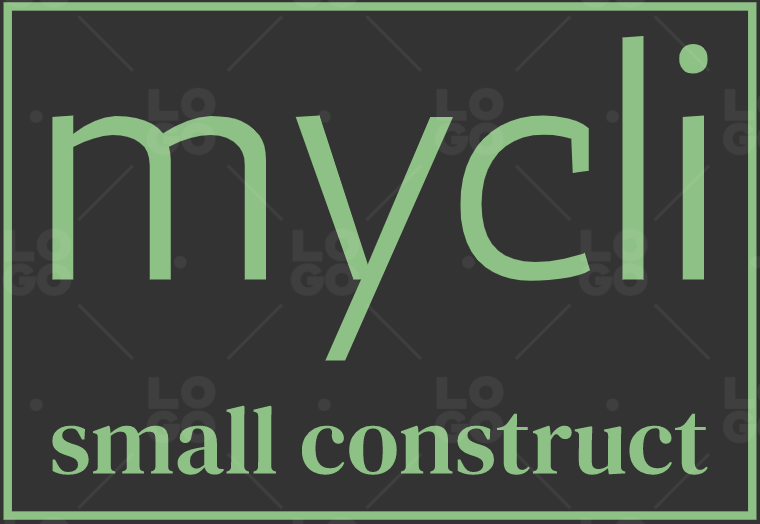

<h2 style="text-align:center">my-cli</h2>
 

<a href="https://devui.design/admin-page/home" target="_blank" rel="noopener noreferrer">

- 目的：

计划打造一套自己的前端生态应用，注重的是应用层面，前端远离层面的知识在[另一个工程中]()记录。

整个前端工程生态的应用，包括组件库、node后端工程（使用常用的node框架实现）、CI/CD流程、小程序、跨端实践等。生态的入口计划使用脚手架的方式，因为说到底脚手架克隆下来的就是代码模版，而且这是应用层面的实践，因此使用脚手架是一种非常便捷的管理方式。

- 计划

第一步首先搭建脚手架工具，模版选择在代码中暂时是写死的 ， 模版使用前端vue 工程模版。

第二步，自己的计划是搭建一套完整的组件库，因为笔者现在主要的工作是正是写业务组件的阶段，所以有必要写一个完整的小型组件库，这里完整的含义是包括基本的构建工具和纯ui组件。可以在此基础上不断的迭代，添加新的组件。

第三步，是node阶段，这一阶段首先是用node框架搭建restful接口，作为后端接口项目的模版。之后的操作是使用node搭建不涉及web的项目，比如说线程、进程的管理以及内存管理相关的demo.作为入门node框架的一个入口。

第三步。 是跨端程序的入门，像是flutter 。同时包括小程序。 这一部分投入的精力少一些，因为业务比重大一些。

- ps：

时间层面上耗时比较的久， 要坚持到跳槽的那一阶段，同时这也是自己带前端培训项目的积累之一，总之对于我个人来说，其价值是非常的大。另外，有想学前端技术的同学，可以加我个人微信交流，WeChat：Yingbin192；